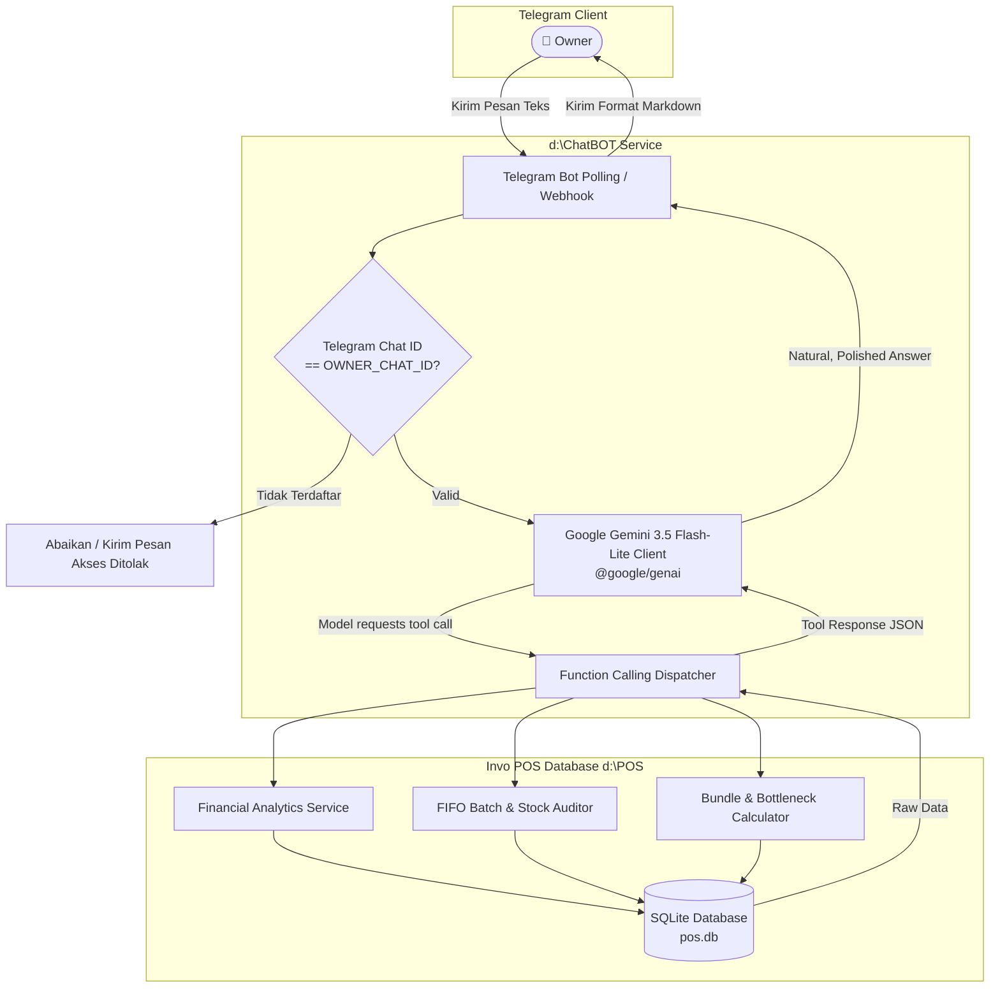

# SPEC-001: Invo Executive AI Copilot (Telegram Assistant)

## 1. Context & Business Problem
* **Project Name:** Invo Executive AI Copilot
* **Target User:** Business Owner & Executive Management
* **Workspace Location:** `d:\ChatBOT`
* **Underlying POS System:** Invo POS & FIFO Inventory Management (`d:\POS`)
* **Problem Statement:** 
  Pemilik bisnis (Owner) seringkali berada di luar toko dan kesulitan memantau metrik performa vital (omzet harian, laba bersih riil setelah HPP FIFO, dead stock yang mengendap, dan kapasitas hampers/bundling) tanpa harus membuka laptop atau login ke dashboard kasir fisik.
* **Goal:** 
  Menyediakan asisten eksekutif 24/7 via Telegram Bot yang ditenagai oleh **Google Gemini AI (gemini-3.5-flash-lite)** dengan **Function Calling / Tool Use**, mampu menjawab pertanyaan finansial dalam bahasa natural dan memberikan rekomendasi bisnis proaktif berbasis data riil SQLite Invo POS (`pos.db`).

---

## 2. Functional Scope & Capabilities

### Core Capabilities (MVP)
1. **Financial Performance Inquiries (`getFinancialSummary`):**
   - Menghitung Omzet, Total HPP (COGS FIFO), Laba Kotor, Total Beban Operasional, dan Laba Bersih.
   - Fleksibilitas periode: `today`, `yesterday`, `this_week`, `this_month`, atau custom date range.
2. **FIFO & Dead Stock Audit (`getFIFOInventoryAudit`):**
   - Mendeteksi batch inventori yang belum habis dengan usia penyimpanan > $N$ hari.
   - Menghitung total nilai modal (HPP) yang mengendap pada batch-batch tersebut.
   - Memberikan daftar item prioritas yang harus segera diputar.
3. **Dual-Mode Stock & Bundle Status (`getStockStatus`):**
   - Menampilkan posisi stok barang dalam mode *Floating Pool* (stok bebas) vs *Physical Allocation* (stok terkunci di rak display).
   - Memeriksa kapasitas produksi paket bundling / hampers berdasarkan item *bottleneck*.
4. **Proactive Business Recommendations (`getBusinessRecommendations`):**
   - Memberikan rekomendasi strategis konkret:
     - Saran *Switching* dari Floating ke Physical Allocation untuk promo dead stock.
     - Rekomendasi restock dini sebelum kehabisan bahan hampers.
     - Peringatan margin tipis jika ada lonjakan biaya dasar supplier.

### Out of Scope (Non-MVP)
* Melakukan transaksi penjualan / checkout via Telegram (kasir tetap di Invo POS).
* Menghapus atau mengubah master data (bot bersifat Read-Only untuk pelaporan & analitik, demi integritas data).
* Chatbot publik untuk konsumen umum (fokus MVP eksklusif untuk Owner).

---

## 3. System Architecture & Flow



---

## 4. Technical Specifications & Tool Contracts

### 4.1 Tech Stack
* **Runtime:** Node.js (v18+)
* **Bot Framework:** `grammy` (modern & lightweight Telegram bot framework for Node.js)
* **LLM SDK:** `@google/genai` (Official Google Gen AI SDK, model: `gemini-3.5-flash-lite`)
* **Database Driver:** `better-sqlite3` + `knex` (Read-Only access ke `d:\POS\database\pos.db`)
* **Config:** `dotenv`

### 4.2 Security Model
* **Owner Whitelist:** File `.env` memuat `TELEGRAM_OWNER_ID`. Setiap pesan masuk melewati middleware:
  ```javascript
  if (ctx.from.id.toString() !== process.env.TELEGRAM_OWNER_ID) {
    return ctx.reply("⛔ Akses ditolak. Bot ini hanya dapat diakses oleh Owner resmi.");
  }
  ```
* **Read-Only Database Connection:** Knex instance di `d:\ChatBOT` hanya melakukan operasi `SELECT` untuk menjaga data pos tetap aman dan tidak korup.

### 4.3 Gemini Function Declarations (Tools)

#### Tool 1: `getFinancialSummary`
```json
{
  "name": "getFinancialSummary",
  "description": "Mengambil ringkasan omzet penjualan, HPP FIFO, beban operasional, dan laba kotor/bersih untuk periode tertentu.",
  "parameters": {
    "type": "OBJECT",
    "properties": {
      "period": {
        "type": "STRING",
        "description": "Pilihan periode: 'today', 'yesterday', 'this_week', 'this_month', atau 'all_time'",
        "enum": ["today", "yesterday", "this_week", "this_month", "all_time"]
      }
    },
    "required": ["period"]
  }
}
```

#### Tool 2: `getFIFOInventoryAudit`
```json
{
  "name": "getFIFOInventoryAudit",
  "description": "Mengaudit batch stok inventori, mencari dead stock berdasarkan usia barang (hari), serta menghitung modal yang tertahan.",
  "parameters": {
    "type": "OBJECT",
    "properties": {
      "staleDaysThreshold": {
        "type": "INTEGER",
        "description": "Batas hari penyimpanan untuk dikategorikan lambat (default: 30 hari)."
      },
      "limit": {
        "type": "INTEGER",
        "description": "Maksimal item dead stock teratas yang ditampilkan (default: 10)."
      }
    }
  }
}
```

#### Tool 3: `getStockStatus`
```json
{
  "name": "getStockStatus",
  "description": "Melihat rincian stok barang tertentu, termasuk status Floating Pool vs Physical Allocation, serta kapasitas bundling/hampers.",
  "parameters": {
    "type": "OBJECT",
    "properties": {
      "searchKeyword": {
        "type": "STRING",
        "description": "Nama atau potongan nama produk/item yang ingin dicek."
      }
    }
  }
}
```

#### Tool 4: `getBusinessRecommendations`
```json
{
  "name": "getBusinessRecommendations",
  "description": "Menganalisis anomali stok, pergerakan barang, dan komposisi margin untuk menghasilkan rekomendasi aksi bisnis (repackage kuota promo, bundle diskon, restock).",
  "parameters": {
    "type": "OBJECT",
    "properties": {}
  }
}
```

---

## 5. Verification & Acceptance Criteria (Definition of Done)

| No | Test Case / Scenario | Expected System Behavior |
| :--- | :--- | :--- |
| **TC-01** | Pengguna asing mengirim pesan chat ke Telegram Bot. | Bot menolak pesan atau mendiamkannya tanpa mengeksekusi LLM/database. |
| **TC-02** | Owner bertanya: *"Berapa omzet dan laba kita hari ini?"* | Gemini memanggil tool `getFinancialSummary(period: 'today')` dan menyajikan rincian Omzet, HPP FIFO, Beban, dan Laba Bersih dalam format rupiah yang rapi. |
| **TC-03** | Owner bertanya: *"Barang apa yang paling lambat mutasinya dan berapa modal yang tertahan?"* | Gemini memanggil `getFIFOInventoryAudit()`, menyajikan nama batch barang, tanggal masuk, sisa stok, dan kalkulasi total Rupiah modal tertahan. |
| **TC-04** | Owner bertanya: *"Ada saran promo atau strategi barang yang mengendap?"* | Gemini memanggil `getBusinessRecommendations()` dan memberikan rekomendasi logis (misal mengemas batch tua menjadi kuota promo eceran via Repackage / Bundling). |
| **TC-05** | Owner bertanya: *"Cek stok kacamata"* | Gemini memanggil `getStockStatus(searchKeyword: 'kacamata')` dan menjelaskan kuota di Floating Pool vs Physical Allocation. |

---

## 6. Implementation Milestones & Live Status

1. **Step 1: Setup Workspace & Dependencies:** `[COMPLETED ✅]`
   - Inisialisasi `package.json` di `d:\ChatBOT`.
   - Install `@google/genai`, `grammy`, `better-sqlite3`, `knex`, `dotenv`.
2. **Step 2: Database Analytics Module (`db/queries.js`):** `[COMPLETED ✅]`
   - Koneksi read-only ke `d:\POS\database\pos.db`.
   - Implementasi query finansial (FIFO COGS, Omzet, Expense).
   - Implementasi query audit batch (FIFO age & tied-up capital analysis).
3. **Step 3: Gemini Tool Engine (`ai/tools.js` & `ai/agent.js`):** `[COMPLETED ✅]`
   - Definisi function declarations & tool dispatcher.
   - Multi-turn function calling loop dengan role `user` response.
   - Integrasi model `gemini-3.5-flash-lite`.
4. **Step 4: Telegram Bot Service (`bot.js` & `index.js`):** `[COMPLETED ✅]`
   - Handler chat Telegram dengan middleware whitelist ID (`TELEGRAM_OWNER_ID`).
   - Quick Keyboard menu & auto text-chunking (max 4096 char).
5. **Step 5: Testing & Verifikasi End-to-End:** `[COMPLETED ✅]`
   - Automated unit test query (`tests/test-tools.js`).
   - Live AI tool invocation test (`tests/test-ai.js`).
   - Demonstrasi visual respons bot (`tests/demo-responses.js`).
   - Bot aktif secara live di Telegram sebagai `@TokoJendralBot`.

---

## 7. Project Structure & Coding Style Guidelines

### Project Structure
- Always use modular, maintainable app project structure for the respective language and web framework.
- Always check if a feature works before moving on to the next feature (do incremental development or agile workflow).
- Add `README.md` file to the root of the project.
- Docs via `mkdocs` (jika diperlukan untuk dokumentasi).

### Coding Style
- Use `snake_case` for variable and function names.
- Use `CamelCase` for class names.
- Use clean style guide for code formatting.
- Use descriptive variable and function names that are self-explanatory.
- Use descriptive class names that are self-explanatory.
- Use descriptive docstrings for functions and classes.
- Use descriptive comments for code that is not self-explanatory.
